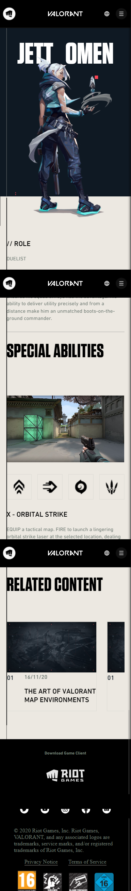
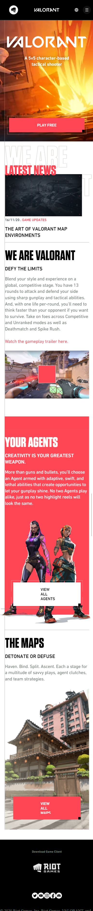
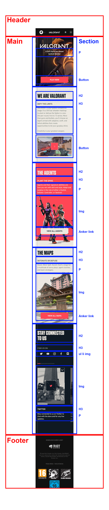
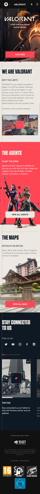
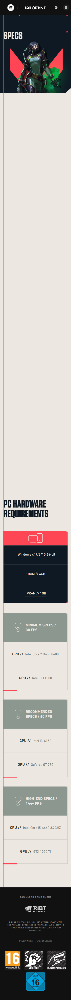

# Procesverslag
**Auteur:** -Lars Kamman-

Markdown cheat cheet: [Hulp bij het schrijven van Markdown](https://github.com/adam-p/markdown-here/wiki/Markdown-Cheatsheet). Nb. de standaardstructuur en de spartaanse opmaak zijn helemaal prima. Het gaat om de inhoud van je procesverslag. Besteedt de tijd voor pracht en praal aan je website.

## Bronnenlijst
1. -https://stackoverflow.com/questions/2460100/remove-the-complete-styling-of-an-html-button-submit-
2. -http://jsbin.com/nukic/2/edit?html,css,output-
3. -https://css-tricks.com/snippets/css/complete-guide-grid/-
4. -https://css-tricks.com/snippets/css/a-guide-to-flexbox/-
5. -https://codepen.io/Axiol/pen/mdeyWwQ-
6. -https://stackoverflow.com/questions/14483589/z-index-not-working-with-position-absolute-
7. -https://www.w3schools.com/css/css_dropdowns.asp-

## Eindgesprek (week 7/8)

-dit ging goed & dit was lastig-

**Screenshot(s):**

-screenshot(s) van je eindresultaat-

## Voortgang 3 (week 6)

-dit ging goed & dit was lastig-
-Er zit nu een grid en het is nu deels responsive-

## Voortgang 2 (week 5)

-dit ging goed & dit was lastig-
-Vergeten schreeshot te nemen, heb de 2 pagina laten zien die nog niet helemaal uitgewerkt was-

## Voortgang 1 (week 3)

### Stand van zaken

-dit ging goed & dit was lastig-
-Het was moeilijk om met alleen flexbox de hele achtergrond rood te maken ivm de linker lijn-

**Screenshot(s):**

-screenshot(s) van hoe ver je bent met korte uitleg-

### Agenda voor meeting

-samen met je groepje opstellen-

| student 1      | student 2          | student 3    | student 4        |
| ---            | ---                | ---          | ---              |
| menu ul li  | en dit             | en ik dit    | en dan ik dat    |
| an dat ook nog | dit als er tijd is | nog een punt | dit wil ik zeker |
| ...            | ...                | ...          | ...              |

### Verslag van meeting

-na afloop snel uitkomsten vastleggen-

## Breakdownschets (week 1)

## Intake (week 1)
-uitwerken voor de kick-off werkgroep - begin van de eerste week-

**Je startniveau:** zwart

**Je focus:** surface plane

**Je opdracht:** https://playvalorant.com/en-gb/

**Screenshot(s) van de eerste pagina (small screen):**

**Screenshot(s) van de tweede pagina (small screen):**

